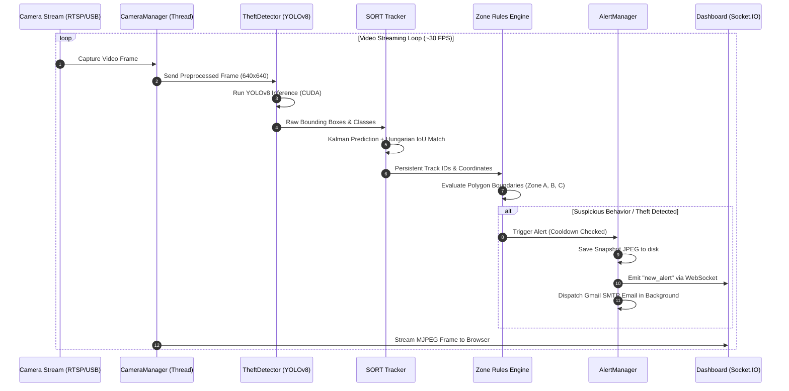

# 🏛️ Vigilant Eye — System Architecture & Data Flow

This document outlines the detailed system architecture, data pipelines, state machines, and component interactions of **Vigilant Eye**.

---

## 📌 Table of Contents
1. [High-Level Architecture](#1-high-level-architecture)
2. [End-to-End Video Processing & AI Pipeline](#2-end-to-end-video-processing--ai-pipeline)
3. [Anti-Theft Zone State Machine](#3-anti-theft-zone-state-machine)
4. [Event-Driven Alert & WebSocket Lifecycle](#4-event-driven-alert--websocket-lifecycle)
5. [Database Entity-Relationship (ER) Diagram](#5-database-entity-relationship-er-diagram)
6. [Dual-Stack Environment Architecture](#6-dual-stack-environment-architecture)
7. [Mobile Drawer State Machine & Transition Lifecycle](#7-mobile-drawer-state-machine--transition-lifecycle)

---

## 1. High-Level Architecture

```text
                                  ┌────────────────────────┐
                                  │   Surveillance Camera   │
                                  │   (RTSP / USB / File)  │
                                  └───────────┬────────────┘
                                              │
                                              ▼
                                  ┌────────────────────────┐
                                  │ CameraManager (Daemon) │
                                  │   Thread-safe capture  │
                                  └───────────┬────────────┘
                                              │ Raw BGR Frames
                                              ▼
                                  ┌────────────────────────┐
                                  │   FramePreprocessor    │
                                  │ Aspect-ratio letterbox │
                                  └───────────┬────────────┘
                                              │ 640x640 Tensor
                                              ▼
                                  ┌────────────────────────┐
                                  │ TheftDetector (YOLOv8) │
                                  │ GPU (Device 0) / CPU   │
                                  └───────────┬────────────┘
                                              │ Bounding Boxes & Confidence
                                              ▼
                                  ┌────────────────────────┐
                                  │  SORT Spatial Tracker  │
                                  │ Kalman Filter Tracking │
                                  └───────────┬────────────┘
                                              │ Track IDs + Trajectories
                                              ▼
                                  ┌────────────────────────┐
                                  │ Multi-Zone Logic Engine│
                                  │ Zone A ➔ B ➔ C Audit   │
                                  └───────────┬────────────┘
                                              │ Security Violation Event
                        ┌─────────────────────┴─────────────────────┐
                        ▼                                           ▼
             ┌─────────────────────┐                     ┌─────────────────────┐
             │    AlertManager     │                     │  SQLite DB Storage  │
             │ Socket.IO / SMTPLib │                     │  (Events & Audits)  │
             └──────────┬──────────┘                     └─────────────────────┘
                        │
       ┌────────────────┼────────────────┐
       ▼                ▼                ▼
┌──────────────┐ ┌──────────────┐ ┌──────────────┐
│ Web Dashboard│ │ Gmail SMTP   │ │ Firebase FCM │
│ (Audio Siren)│ │ (Snapshots)  │ │ (Push Alerts)│
└──────────────┘ └──────────────┘ └──────────────┘
```

---

## 2. End-to-End Video Processing & AI Pipeline



---

## 3. Anti-Theft Zone State Machine

Each camera view can be configured with geometric zones to analyze customer behavior:

```text
   ┌────────────────────────────────────────────────────────┐
   │                    STORE ENTRANCE                      │
   └──────────────────────────┬─────────────────────────────┘
                              │ Customer enters
                              ▼
   ┌────────────────────────────────────────────────────────┐
   │                  ZONE A: SHELF AREA                    │
   │  • Track dwell time (Violates if > 90 frames / 3s)     │
   │  • Detect hand-to-pocket and item pickup heuristics    │
   └───────────┬────────────────────────────────┬───────────┘
               │ Normal Path                    │ Suspicious Path
               ▼                                │ (Checkout Bypass)
   ┌───────────────────────┐                    │
   │ ZONE B: CHECKOUT / POS│                    │
   │ • Payment verified    │                    │
   │ • Item scanned        │                    │
   └───────────┬───────────┘                    │
               │ Clearance Confirmed            │
               ▼                                ▼
   ┌────────────────────────────────────────────────────────┐
   │                 ZONE C: STORE EXIT                     │
   │  • If coming from Zone B ➔ [STATUS: NORMAL EXIT]       │
   │  • If coming from Zone A directly ➔ 🚨 [THEFT ALARM]   │
   └────────────────────────────────────────────────────────┘
```

---

## 4. Event-Driven Alert & WebSocket Lifecycle

```text
[Incident Detected]
         │
         ▼
[Cooldown Filter] ──── (Within 5s of previous alert?) ───► (Drop duplicate)
         │ No
         ▼
[Snapshot Saved] ────► `snapshots/snapshot_cam{id}_{ts}.jpg`
         │
         ├─────────────────────────────────────────┐
         ▼                                         ▼
[Socket.IO Broadcast]                    [Verified Email Manager]
  Event: `new_alert`                               │
  Payload:                                         ▼
  • Camera ID & Name                     [Load Verified Recipients]
  • Activity Type                        `system_settings.verified_alert_emails_list`
  • Severity & Confidence                          │
  • Base64 Snapshot Image                          ▼
         │                               [Background SMTP Thread]
         ▼                               • TLS Connection to smtp.gmail.com:587
[Dashboard UI Reaction]                  • 16-Digit Google App Password Auth
  • Audio siren playback                 • Embedded snapshot attachment
  • Red flashing badge                   • Dispatched to all active recipients
  • New row in Live Feed
```

---

## 5. Database Entity-Relationship (ER) Diagram

```text
┌───────────────────────┐             ┌───────────────────────┐
│         User          │             │        Camera         │
├───────────────────────┤             ├───────────────────────┤
│ PK  id                │             │ PK  id                │
│     name              │             │     camera_uid        │
│     email (unique)    │             │     name              │
│     password_hash     │             │     source            │
│     role              │             │     camera_type       │
│     theme             │             │     location          │
│     email_verified    │             │     is_active         │
│     auth_method       │             │     total_alerts      │
└──────────┬────────────┘             └──────────┬────────────┘
           │                                     │
           │ 1:N (initiated_by)                  │ 1:N
           ▼                                     ▼
┌───────────────────────┐             ┌───────────────────────┐
│    TrainingSession    │             │         Event         │
├───────────────────────┤             ├───────────────────────┤
│ PK  id                │             │ PK  id                │
│     started_at        │             │     event_uid         │
│     status            │             │ FK  camera_id         │
│     epochs            │             │     activity_type     │
│     dataset_size      │             │     confidence        │
│     accuracy          │             │     timestamp         │
│     model_path        │             │     snapshot_path     │
│ FK  initiated_by      │             │     severity          │
└───────────────────────┘             └───────────────────────┘

┌──────────────────────────────────┐
│          SystemSettings          │
├──────────────────────────────────┤
│ PK  id                           │
│     key (unique, indexed)        │  <-- e.g. "verified_alert_emails_list"
│     value (Text / JSON)          │
│     updated_at                   │
└──────────────────────────────────┘
```

---

## 6. Dual-Stack Environment Architecture

```text
┌─────────────────────────────────────────────────────────────────────────┐
│                             VIGILANT EYE                                │
├────────────────────────────────────┬────────────────────────────────────┤
│     Full Server Stack (Local)      │    Edge Serverless Stack (Vercel)  │
├────────────────────────────────────┼────────────────────────────────────┤
│ Path: `/`                          │ Path: `/vercel_demo/`              │
│ Server: Flask + Flask-SocketIO     │ Server: Vercel Edge Serverless     │
│ Runtime: Python 3.10+ (CUDA GPU)   │ Runtime: Modern Web Browser (WASM) │
│ Inference: PyTorch YOLOv8n         │ Inference: TensorFlow.js COCO-SSD  │
│ Camera Sources: RTSP, USB, Files   │ Camera Sources: Browser webcam     │
│ Database: SQLite (`surveillance.db`)│ Database: Browser `localStorage`  │
│ Templates: Jinja2 in `templates/`  │ Templates: Static HTML5 in root    │
│ Deployment: On-Premises Server     │ Deployment: Global Vercel CDN Edge │
└────────────────────────────────────┴────────────────────────────────────┘
```

---

## 7. Mobile Drawer State Machine & Transition Lifecycle

```mermaid
stateDiagram-v2
    [*] --> Closed: Initial Load (width <= 900px)

    state Closed {
        [*] --> OffScreen
        OffScreen: transform: translate3d(-100%, 0, 0)
        OffScreen: Overlay opacity = 0 (pointer-events: none)
        OffScreen: Body scroll unlocked
    }

    Closed --> Opening: Tap #mobileMenuBtn (Hamburger)
    
    state Opening {
        [*] --> ReflowFlush
        ReflowFlush: void sidebar.offsetWidth (flush layout cache)
        ReflowFlush --> TransitionIn: Add .mobile-open & .active to overlay
        TransitionIn: GPU slide transform -> translate3d(0, 0, 0) [340ms cubic-bezier]
        TransitionIn: Add .drawer-open-lock to body & html
    }

    Opening --> Open: Transition Complete

    state Open {
        [*] --> DisplayDrawer
        DisplayDrawer: Sidebar pinned at left: 0 (width: 290px / 82vw)
        DisplayDrawer: Nav middle scrolls smoothly (flex: 1 1 auto; overflow-y: auto)
        DisplayDrawer: Compact 58px footer pinned strictly at bottom
        DisplayDrawer: Native scrollbars fully suppressed
    }

    Open --> Closing: Tap Close X / Backdrop / Nav Item / Profile
    
    state Closing {
        [*] --> SlideOut
        SlideOut: Remove .mobile-open (GPU slide back to -100%)
        SlideOut: Remove .active on overlay (fade out)
        SlideOut --> ReflowDecouple: 350ms Timer Running
        ReflowDecouple: Delay removing .drawer-open-lock from body
    }

    Closing --> Closed: Timer expires & Drawer is fully off-screen
```
